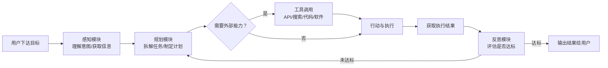
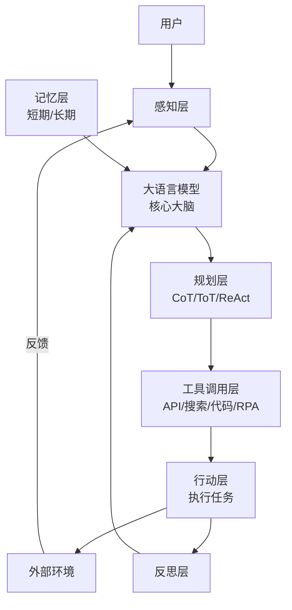
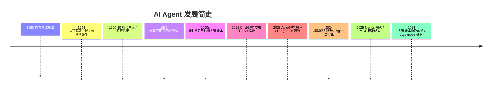

# AI Agent（智能体）科普指南

> 从概念到实践，一文读懂 AI Agent
>
> 整理时间：2026 年 8 月｜面向：非技术背景到入门开发者

---

## 目录

1. [一句话概括](#一句话概括)
2. [什么是 AI Agent](#什么是-ai-agent)
3. [Agent 与普通大模型有什么区别](#agent-与普通大模型有什么区别)
4. [Agent 的五大核心能力](#agent-的五大核心能力)
5. [Agent 是怎么工作的](#agent-是怎么工作的)
6. [Agent 的核心架构](#agent-的核心架构)
7. [发展历程](#发展历程)
8. [主流框架与工具](#主流框架与工具)
9. [典型应用场景](#典型应用场景)
10. [落地挑战与风险](#落地挑战与风险)
11. [未来展望](#未来展望)
12. [学习路径建议](#学习路径建议)
13. [参考资料](#参考资料)

---

## 一句话概括

**AI Agent（人工智能体）是以大语言模型（LLM）为"大脑"，具备感知、规划、记忆、工具调用和反思能力，能够自主理解目标、拆解任务、调用外部资源、执行复杂流程并迭代优化的智能实体。**

核心公式：

```
AI Agent = LLM（大脑） + 规划 + 记忆 + 工具调用 + 反思
```

本质上是把 AI 从"被动问答"升级为"目标驱动的自主代理"——**人定目标，AI 自主完成**。

---

## 什么是 AI Agent

### 通俗定义

Agent 这个词源于拉丁语 "agere"，意为"去做"。在 AI 领域，**智能体（Agent）是指能够感知环境、自主决策并执行任务以实现特定目标的智能实体**。

打个比方：

- 传统大模型（如 ChatGPT 的问答模式）像一位"只会说话的顾问"——你问它问题，它给你建议，但**不会替你动手**。
- AI Agent 像一位"真正的助理"——你交代一个目标（比如"帮我订一份晚餐外卖"），它会自己拆解步骤、搜索选择、调用外卖 App、完成支付，最后向你汇报结果。

### 关键要点

| 要点 | 说明 |
|------|------|
| **感知** | 接收用户指令、读取数据、获取环境信息 |
| **决策** | 基于目标和大模型推理，制定行动计划 |
| **行动** | 通过工具（API、软件、代码、浏览器等）真正执行任务 |
| **自主性** | 无需全程人工干预，可自主处理分支与异常 |
| **适应性** | 能从执行结果中学习、反思、调整策略 |

---

## Agent 与普通大模型有什么区别

两者常被混淆，但定位完全不同：

| 对比维度 | 普通大语言模型（LLM） | AI Agent（智能体） |
|---------|---------------------|-------------------|
| **目标** | 理解和生成自然语言 | 完成特定任务、达成目标 |
| **能力** | 语言理解与生成 | 感知 + 决策 + 执行 + 学习 |
| **架构** | 单一模型 | 多模块系统（模型 + 记忆 + 工具 + 规划） |
| **交互** | 被动响应（请求-应答） | 主动行动（感知-规划-行动循环） |
| **环境** | 无环境交互能力 | 可实时与环境交互（API、软件、物理设备） |
| **记忆** | 依赖上下文窗口，会话结束即忘 | 具备短期 + 长期记忆 |
| **典型局限** | 幻觉、无实际行动能力、无长期记忆 | 部分缓解上述问题（仍需人机协同控制） |

**两者的关系**：Agent 以大模型为底层智能底座，大模型是 Agent 的"大脑"；但 Agent 不只有大模型，还组合了记忆、工具、规划等其他模块。在实际应用中，两者往往相辅相成。

---

## Agent 的五大核心能力

### 1. 自主性（Autonomy）
无需人类逐步指令，Agent 能自主决定行动路径、处理异常情况。你只需要给出目标，剩下的交给它。

### 2. 目标导向（Goal-driven）
围绕用户目标拆解任务、动态调整策略。任务中途失败会自动重试或换方案，而不是简单放弃。

### 3. 环境交互（Environment Interaction）
通过感知模块获取信息，通过行动模块影响环境，并接收执行反馈形成闭环。

### 4. 工具复用（Tool Use）
调用搜索引擎、代码解释器、API、数据库、RPA、浏览器等外部能力，突破大模型自身的局限（实时数据、精确计算、实际操作）。

### 5. 记忆与反思（Memory & Reflection）
- **短期记忆**：当前任务上下文（相当于工作记忆）
- **长期记忆**：用户偏好、历史任务、知识库（相当于经验）
- **反思**：评估执行结果，复盘失败原因，自我优化策略

---

## Agent 是怎么工作的

Agent 的工作本质是一个 **"感知 → 规划 → 行动 → 反思"** 的循环：



### 关键技术：ReAct（Reason + Act）

ReAct 是目前最主流的 Agent 工作范式之一（2022 年由 Yao et al. 提出）。它让大模型**边推理、边行动**，交替进行：

```
思考（Thought）: 用户要查今天北京的天气，我需要调用天气 API
行动（Action）: 调用 weather_api(城市="北京")
观察（Observation）: {"温度": 32, "天气": "晴"}
思考（Thought）: 查询成功，我可以组织回答
回答（Answer）: 今天北京晴，32℃，注意防暑
```

通过这种"想一步、做一步、看结果、再想"的循环，Agent 能处理需要多步操作的真实任务。

### 其他常用规划技术

| 技术 | 说明 |
|------|------|
| **CoT（思维链）** | 把复杂问题拆成分步推理，提升逻辑性 |
| **ToT（思维树）** | 同时探索多条推理路径，投票选出最优解 |
| **ReAct** | 推理与行动交替进行，边思考边执行 |
| **Reflexion** | 通过自我反馈机制复盘失败，迭代改进 |
| **分层规划** | 高层计划逐级分解为详细子计划 |

---

## Agent 的核心架构

现代 Agent 系统通常由六大模块组成（参考 2025-2026 年主流技术综述与产业实践）：

### ① 感知层（输入 / 感官）
- **功能**：采集多模态信息——文本、语音、图像、传感器数据、网页内容、API 数据
- **技术**：NLP、语音识别、计算机视觉、信息抽取、RAG（检索增强生成）
- **类比**：人的五官

### ② 规划层（决策 / 大脑）
- **功能**：将复杂目标拆解为可执行子任务，生成执行流程，处理分支与异常
- **技术**：CoT、ToT、ReAct、MRKL（模块化推理）
- **类比**：人的思维与判断

### ③ 记忆层（经验 / 存储）
- **短期记忆**：对话上下文、当前任务状态（LLM 上下文窗口）
- **长期记忆**：用户偏好、历史任务、知识库、反思结果（向量数据库、知识图谱）
- **工作记忆**：临时存储执行中的中间结果
- **类比**：人的记忆系统

### ④ 工具调用层（能力扩展 / 手脚）
- **功能**：对接外部工具，突破 LLM 自身局限
- **典型工具**：搜索引擎、代码解释器、API 接口、数据库、RPA、浏览器、专业软件
- **机制**：工具注册 → 决策调用 → 参数传递 → 结果解析 → 反馈给规划层
- **类比**：人的双手和各种工具

### ⑤ 行动层（执行）
- **功能**：把决策转化为实际行动——输出文本、生成报告、调用 API、操作系统、控制硬件
- **类比**：人的肢体动作

### ⑥ 反思与学习层（优化）
- **功能**：评估执行结果是否达标；复盘失败原因；调整规划与策略
- **类比**：人的复盘与成长

> **架构总览**（经典 Agent 分层图）：



---

## 发展历程

### 思想萌芽期（1950s–1980s）
- **1950 年**：艾伦·图灵提出"图灵测试"，为机器智能设立评判标准
- **1956 年**：达特茅斯会议正式确立"人工智能"学科
- **1960s–1980s**：符号主义主导，专家系统、逻辑推理构建早期智能体

### 行为主义与复兴期（1980s–2000s）
- **1986 年**：罗德尼·布鲁克斯提出"包容式架构"，强调行为模块叠加产生智能
- 强化学习、机器人智能体研究兴起（如智能体在游戏、控制领域的应用）

### 大模型驱动的爆发期（2022–2024）
- **2022 年底**：ChatGPT 发布，大模型成为 Agent 的"通用大脑"
- **2022 年**：ReAct 范式提出，Agent 有了标准化的"推理-行动"循环
- **2023 年**：AutoGPT、BabyAGI 等自主 Agent 项目引爆讨论；LangChain 等框架快速流行
- **2024 年**：Claude 3.5、GPT-4o 等模型能力跃升，Agent 从实验室走向工程化

### 工程化落地期（2025–2026）
- **2025 年**：Manus（通用智能体）大火，引发产业关注；MCP（Model Context Protocol）由 Anthropic 提出并迅速成为工具接入的事实标准；OpenAI 发布 Agent SDK；Agent 进入"感知-规划-行动"重构人机协作范式的新阶段
- **2026 年**：多智能体协作（Multi-Agent）成为主流架构，LangGraph、CrewAI、AutoGen 等框架成熟；国内各大厂商密集发布 Agent 平台（阿里百炼、百度千帆、字节扣子、华为 AgentArts 等）；AgentOps（可观测、成本分析）成为企业标配能力

> **时间线一览**：



---

## 主流框架与工具

截至 2026 年年中，Agent 开发框架呈"多强并立"格局：

### 开源框架

| 框架 | 特点 | 适合场景 |
|------|------|---------|
| **LangGraph**（LangChain 生态） | 有状态图编排，支持循环、分支、持久化 | 企业级复杂工作流、需要精确控制的状态机 |
| **CrewAI** | 基于角色的多 Agent 协作，开箱即用 | 研究、写作等需要角色分工的团队式任务 |
| **Microsoft AutoGen / Agent Framework** | 多智能体对话式协作，支持人机协同 | 多 Agent 辩论、分层委派、HITL 流程 |
| **OpenClaw** | 多平台接入，GitHub 高星项目 | 跨平台自动化、桌面级任务执行 |
| **OpenAI Agents SDK** | 与 OpenAI 模型深度集成，函数调用无缝 | 已绑定 OpenAI API 的轻量级应用 |

### 闭源 / 云平台

| 平台 | 特点 |
|------|------|
| **Anthropic Claude Agent SDK + MCP** | 安全优先、工具接入标准化的生态领导者 |
| **Google Agent Development Kit (ADK)** | 原生多模态（文本/图像/视频/音频） |
| **Amazon Bedrock Agents / Google Vertex AI Agents** | 云原生托管，企业级基础设施 |
| **阿里云百炼 / 魔搭** | 中文优化，与通义千问深度集成 |
| **百度智能云千帆** | 文心一言原生支持，政企市场为主 |
| **字节跳动扣子（Coze）** | 低代码 Bot 开发，海外版已集成 GPT-4 |
| **华为 AgentArts** | 企业级智能体开发平台（2026 年 4 月公测） |
| **实在智能（实在 Agent）** | 屏幕语义理解技术，无需 API 即可操作老旧系统软件 |

### 标准化协议

- **MCP（Model Context Protocol）**：由 Anthropic 于 2024 年底提出，定义 Agent 连接外部工具和数据源的标准客户端-服务器协议，2025-2026 年已迅速发展为事实标准，被 OpenAI、Google 等跟进支持。
- **Agent 间通信协议**：2026 年业界正在推动多智能体间的标准化通信（类似互联网的 TCP/IP），实现跨平台 Agent 协作。

> ⚠️ 说明：以上框架的**具体性能数字**（如 OSWorld 评测成绩、SWE-Bench 分数等）多为厂商或媒体报道数据，同一任务的评测口径可能不同，选型时应以官方文档和独立评测为准。

---

## 典型应用场景

### 1. 客户服务（最成熟、ROI 最高）
智能客服 Agent 处理一线咨询、查询账户信息、执行退款/改签等操作，复杂问题无缝转接人工并保留完整上下文。据报道，成熟方案可将人工处理的工单量降低 40%–60%。

### 2. 软件开发（增长最快的场景）
Cursor Agent、Claude Code、GitHub Copilot Workspace 等工具可自主实现功能、编写测试、调试代码、重构项目。Agent 能理解代码库、遵循项目规范、执行多步骤开发任务。

### 3. 办公自动化
- 整理会议纪要、生成报告、管理日程
- 跨系统数据录入与流转（Agentic RPA）
- 桌面级任务执行：操作浏览器、Office 软件完成复杂流程

### 4. 医疗健康
AI 诊疗助手提供诊断支持、个性化治疗方案与健康管理建议，提升诊疗效率与可及性（注：医疗场景需严格的合规与人工审核，Agent 目前作为辅助工具）。

### 5. 金融服务
金融智能体实时监控交易、检测欺诈活动、预防网络威胁，减少误报并提升交易安全性；投研 Agent 自动整理研报、分析财报。

### 6. 数据分析与决策支持
"分析季度销售数据并生成图表"这类任务，Agent 可以自主完成取数 → 分析 → 可视化 → 输出结论的全流程。

### 7. 个人生活助理
订外卖、订机票、比价购物——Agent 调用多个应用完成从选择到支付的全过程。

---

## 落地挑战与风险

### 1. 幻觉问题
大模型可能编造不存在的"事实"，Agent 在自主执行时可能基于幻觉信息做出错误决策。需要通过检索增强（RAG）、工具验证、输出校验等手段缓解。

### 2. 可靠性与错误传播
多步骤任务中，任何一步出错都可能被放大。2024 年前后业界普遍存在的"不可靠性鸿沟"，如今通过状态机编排（循环图）、错误重试、人工检查点（HITL）等方式部分解决。

### 3. 安全与对齐
- Agent 拥有真实执行能力，必须通过**沙箱隔离、权限控制、策略引擎**约束其行为边界
- 高风险的行动（付款、删除数据、发送邮件）需要**人工审批**（Human-in-the-Loop）
- 防止提示注入攻击（恶意指令劫持 Agent）

### 4. 成本失控
Agent 反复调用模型、循环执行，token 消耗可能远超预期。需要速率限制、预算控制、AgentOps 成本分析。

### 5. 可观测性不足
自主系统的行为链路复杂，难以追踪。AgentOps（Agent 运维）正成为标配：追踪每次调用、定位瓶颈、审计执行记录。

### 6. 伦理与合规
- 自主决策的责任归属问题（Agent 出错谁负责？）
- 数据隐私与合规（尤其是医疗、金融等高敏场景）
- 就业影响与社会公平议题

---

## 未来展望

### 1. 多智能体协作（Multi-Agent）成为主流
不再让一个"超级 Agent"包办一切，而是构建"Agent 团队"——研究员、编辑、合规官各司其职，专业化分工、互相协作。单个 Agent 失败时系统可自愈或通知人类。

### 2. 标准化协议普及
MCP 已让"工具接入"标准化，Agent 间的通信协议正在统一——如同当年 TCP/IP 之于互联网，未来 Agent 可以跨平台、跨厂商自由协作。

### 3. 有状态、长周期任务
Agent 从"几分钟的任务"走向"跨天、跨周的任务"：可以暂停等待人类反馈，几天后带完整上下文恢复执行。

### 4. 从数字世界走向物理世界
结合机器人硬件，Agent 从操作软件扩展到操作物理设备——具身智能（Embodied AI）是长期方向。

### 5. 人机协同的新范式
"人"被视为工作流中的一个特殊角色，Agent 在关键节点征求人的意见——形成"人定方向，Agent 干活，人审结果"的协作模式。

---

## 学习路径建议

| 阶段 | 建议动作 | 参考资源方向 |
|------|---------|-------------|
| **入门**（1-2 周） | 了解大模型基础、动手体验现成 Agent 产品 | 使用 Claude/ChatGPT 的 Agent 功能；体验扣子 Coze 等低代码平台 |
| **进阶**（1-2 月） | 学习提示工程 + 工具调用，用框架搭建第一个 Agent | LangChain / CrewAI 官方文档；MCP 教程 |
| **实践**（3-6 月） | 掌握状态机编排、记忆设计、AgentOps | LangGraph 官方文档；真实业务场景项目 |
| **深入** | 研究多智能体协作、评测方法、安全对齐 | AutoGen 文档；arXiv 相关综述；ACL/NeurIPS 论文 |

**给初学者的建议**：不要一上来就啃框架源码。先想清楚"我要让 Agent 解决什么问题"，再用最低成本的工具（低代码平台或现成 SDK）把流程跑通，最后再考虑复杂编排。

---

## 参考资料

> 以下为本文主要信息来源，标注时间为资料的发布/检索时间（2026 年 8 月整理）。

1. 中国通信企业协会《AI应用新浪潮 人机协作新图景》（2025 年 3 月）— Agent 概念、核心架构模块定义
2. 内蒙古自治区公安厅《关于智能体，这些你需要了解》（2025 年 10 月）— 智能体定义、核心架构、产业应用
3. NVIDIA AI Glossary: *Autonomous AI Agents*（检索于 2026 年 8 月）— Agent 组件构成、工作流程
4. Shipsquad: *The Complete Guide to AI Agents in 2026*（2026 年）— 框架对比、应用场景、安全机制
5. AgixTech: *Battle of the Frameworks: Best AI Agent Platforms for 2026*（2026 年）— 多智能体趋势、框架演进
6. CSDN 技术博客：2026 年国内 AI Agent 工具盘点、AI Agent 知识点总结（2026 年）— 国产工具与框架现状
7. SegmentFault：《基于大模型的自主智能体：2026 年国内外六大产品能力全景透视》（2026 年）— 国产 Agent 产品能力

> **说明**：本文中提及的厂商产品评测数字（如 OSWorld 成功率、SWE-Bench 分数等）均来自公开媒体报道，仅供参考，不构成选购依据。AI 领域发展极快，本文信息截至 2026 年 8 月，建议持续关注官方文档与权威评测获取最新动态。
