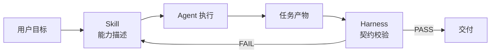

# Skill 与 Harness 理论知识指南

> 本文是 `knowledge_additionsitions/` 的核心理论文件。
> 它定义什么是 **Skill**、什么是 **Harness**，说明两者的区别与协作关系，
> 给出可复用的契约与使用教程，并由同目录下的示例模版印证。
>
> 整理时间：2026 年 8 月｜面向：Agent 工程入门到实践者

---

## 目录

1. [一句话概括](#一句话概括)
2. [什么是 Skill](#什么是-skill)
3. [什么是 Harness](#什么是-harness)
4. [Skill 与 Harness 的区别与协作](#skill-与-harness-的区别与协作)
5. [Skill 契约](#skill-契约)
6. [Harness 契约](#harness-契约)
7. [使用教程：编写一个 Skill](#使用教程编写一个-skill)
8. [使用教程：编写一个 Harness](#使用教程编写一个-harness)
9. [Skill 与 Harness 如何互相印证](#skill-与-harness-如何互相印证)
10. [与 Core-Agent 现有资产的衔接](#与-core-agent-现有资产的衔接)
11. [常见误区](#常见误区)
12. [速查清单](#速查清单)

---

## 一句话概括

```
Skill   = Agent "会做什么"的能力描述（知识 + 流程 + 模板 + 校验点）
Harness = 校验 Agent "做得对不对"的可运行脚手架（CLI + 退出码 + 测试）
```

二者构成一个闭环：

- **Skill** 告诉 Agent **如何完成**某类任务；
- **Harness** 检查 Agent 产出的结果 **是否符合契约**。

> 类比：Skill 是"操作手册"，Harness 是"出厂检验台"。

---

## 什么是 Skill

### 定义

**Skill（技能）** 是一份结构化的、可被 Agent 加载与参考的能力说明包。
它把"完成某一类任务所需的知识、流程、代码模板、易错点和自检项"
固化成一个标准目录，使 Agent 在遇到同类任务时能稳定复用。

### 核心特征

| 特征 | 说明 |
|------|------|
| **声明式** | 以 `SKILL.md` 为主，描述"做什么、怎么做"，而非可执行程序 |
| **结构化** | 固定 frontmatter + 固定章节，便于机器解析与人工阅读 |
| **自包含** | 一个 skill 目录即一个完整能力单元，不依赖外部隐式状态 |
| **可校验** | 内含 Sanity Checks，让产出可被自动或人工核对 |
| **粒度适中** | 一个 skill 解决一类问题，不贪大求全 |

### Skill 的两种类型

1. **领域型 Skill**：解决具体领域任务，如 PDF 抽取、PCAP 分析。
   参见 `Core-Agent/my_skills/` 下已有示例。
2. **方法论型 Skill**：解决"如何做 Agent 工程"本身的问题，
   如如何设计循环、如何写工具策略、如何设计记忆。
   本目录 `skills/example-skill/` 即属此类。

### Skill 不是什么

- 不是可执行的脚本（脚本归 Harness）；
- 不是Prompt 全集（它包含流程与校验，不止提示词）；
- 不是工具函数库（它描述能力，不直接被 import 调用）。

---

## 什么是 Harness

### 定义

**Harness（脚手架/检验台）** 是一个轻量、可独立运行的工具程序，
用于在 Agent 执行前后对 **输入、过程产物或最终产物** 进行契约校验、
度量或转换。它以命令行程序形式存在，给出明确的通过/失败信号。

### 核心特征

| 特征 | 说明 |
|------|------|
| **可执行** | 是一个 `.py` 程序，`python xxx.py` 即可运行 |
| **命令行友好** | argparse 接口，支持参数与 `--json` 机器可读输出 |
| **退出码语义** | `0` 通过、`1` 契约问题、`2` 输入不可读/工具不可用 |
| **零外部依赖** | 仅依赖 Python 标准库（除非任务必需） |
| **可测试** | 每个 harness 配套 `test_*.py`，用 `unittest` 覆盖 |
| **框架无关** | 不绑定某个 Agent 框架，校验的是"产物契约"而非"框架对象" |

### Harness 的三种用途

1. **前置校验**：Agent 执行前，校验输入是否满足前置条件。
2. **产物校验**：Agent 执行后，校验输出是否符合契约。
3. **度量审计**：对 trace / 成本 / 结构等做汇总与阈值检查。

### Harness 不是什么

- 不是 Agent 本身（它不驱动 LLM 循环）；
- 不是 Skill（它不描述"如何完成任务"，而是"如何判断结果对错"）；
- 不是测试框架（它用 `unittest`，但本身是被测对象 + CLI 工具）。

---

## Skill 与 Harness 的区别与协作

### 区别对照

| 维度 | Skill | Harness |
|------|-------|---------|
| **形态** | Markdown 目录包 | Python 程序 + 测试 |
| **角色** | 教 Agent 怎么做 | 判 Agent 做得对不对 |
| **被谁读** | Agent / 人 | CI / 人 / 其他工具 |
| **产出** | 引导生成任务产物 | 对产物给出 PASS/FAIL |
| **依赖** | 无（纯文档） | Python 标准库 |
| **信号** | 无（靠人执行 Sanity Checks） | 退出码 0/1/2 |

### 协作闭环



- Skill 指导 Agent 产出 `P`；
- Harness 校验 `P` 是否合规；
- 不合规时回到 Skill 修正流程。

> 一句话：**Skill 负责"生成"，Harness 负责"把关"**。

---

## Skill 契约

一个 Skill 包至少包含 `SKILL.md`，并建议满足以下结构。

### 目录结构（最小集）

```
<skill-name>/
└── SKILL.md
```

### SKILL.md 结构契约

```markdown
---
name: <skill-name>            # 必填，kebab-case，与目录名一致
description: "<一句话说明>"    # 必填，说明何时使用、覆盖什么
---

# <标题>

## Overview                    # 概述：解决什么问题、典型流程
## <关键概念 / 步骤>           # 正文：概念、流程、代码模板
## Common Mistakes             # 易错点清单
## Sanity Checks               # 自检项清单（可被 Harness 印证）
```

### frontmatter 字段

| 字段 | 必填 | 说明 |
|------|------|------|
| `name` | 是 | kebab-case，与目录名一致 |
| `description` | 是 | 说明"何时用 + 覆盖什么"，便于检索 |

### 内容约束

- **代码块必须可读可改**：给出最小可复用模板，而非伪代码。
- **Common Mistakes 必须具体**：写出"错在哪、改用哪个"。
- **Sanity Checks 必须可核验**：每一条都应能被人工或 Harness 检查。

---

## Harness 契约

一个 Harness 工具至少包含主程序，并配套测试。

### 目录结构（最小集）

```
harness/
├── <name>.py              # 主程序：CLI + 校验逻辑
└── test_<name>.py         # 配套测试：unittest
```

### 主程序契约

1. **入口**：`if __name__ == "__main__": raise SystemExit(main())`。
2. **参数**：用 `argparse`，至少接受一个输入路径或内联数据。
3. **输出**：
   - 默认人类可读文本；
   - `--json` 时输出机器可读 JSON。
4. **退出码**：

| 退出码 | 含义 |
|--------|------|
| `0` | 校验通过 |
| `1` | 校验发现问题（契约不满足） |
| `2` | 输入不可读 / 程序自身不可用 |

5. **依赖**：仅 Python 标准库；如需第三方，在 docstring 注明。
6. **文档**：模块 docstring 写清用途、用法、退出码。

### 测试契约

- 用标准库 `unittest`；
- 至少覆盖：**通过用例**、**失败用例**、**不可读输入用例**（对应退出码 0/1/2）；
- 可用 `python -m unittest test_<name>.py -v` 运行。

---

## 使用教程：编写一个 Skill

### 步骤

1. **确定能力边界**：这个 skill 解决哪一类问题？不要混入其他能力。
2. **建目录**：`my_skills/<skill-name>/`，目录名用 kebab-case。
3. **写 frontmatter**：`name` 与目录名一致，`description` 写清"何时用"。
4. **写 Overview**：一句话目标 + 典型输入输出流程。
5. **写正文**：把流程拆成步骤，每步给最小代码模板。
6. **写 Common Mistakes**：列出该领域高频错误及纠正。
7. **写 Sanity Checks**：列出产出后必查项，**这些项最好能被某个 Harness 自动检查**。

### 模板骨架

详见同目录 `skills/example-skill/SKILL.md`，可直接复制改名使用。

---

## 使用教程：编写一个 Harness

### 步骤

1. **确定校验目标**：要校验什么产物？契约字段有哪些？
2. **写主程序**：
   - 模块 docstring（用途、用法、退出码）；
   - 一个纯函数做核心校验（便于单测），返回结构化结果；
   - `main()` 用 argparse 包裹，处理 `--json` 与退出码；
   - 入口 `raise SystemExit(main())`。
3. **处理输入异常**：`OSError` / `UnicodeDecodeError` / `json.JSONDecodeError` 归为退出码 `2`。
4. **写测试**：覆盖 PASS / FAIL / 不可读 三类用例。
5. **运行验证**：
   ```bash
   python knowledge_additions/harness/example_harness.py --help
   python -m unittest knowledge_additions/harness/test_example_harness.py -v
   ```

### 模板骨架

详见同目录 `harness/example_harness.py` 与 `test_example_harness.py`。

---

## Skill 与 Harness 如何互相印证

本目录的示例刻意设计成一对闭环：

- **Skill 示例** `example-skill` 描述"如何为 Agent 任务生成结构化任务计划"，
  它的 `Sanity Checks` 要求产物必须包含 `task_id`、`status`、非负 `steps` 等字段。
- **Harness 示例** `example_harness.py` 正好校验这些字段。

于是：

- Skill 说"产出要有 task_id"；
- Harness 检查"产物有没有 task_id、是否合法"；
- 二者契约一致，**Skill 的 Sanity Checks = Harness 的校验项**。

> 这就是"印证"：理论里讲的契约，在示例里被一一实现。

---

## 与 Core-Agent 现有资产的衔接

本目录的 Skill 与 Harness 并非孤立发明，而是对 `Core-Agent/` 现有风格的延续。

| 现有资产 | 衔接关系 |
|---------|---------|
| `Core-Agent/my_skills/*/SKILL.md` | 本目录 skill 示例遵循同样的 frontmatter + 章节风格 |
| `Core-Agent/agent_trace_validator.py` | 本目录 harness 示例遵循同样的 argparse + 退出码 + 标准库风格 |
| `Core-Agent/test_*.py` | 本目录测试遵循同样的 `unittest` 风格 |
| `Core-Agent/AGENT_TASK_TEMPLATE.md` | skill 示例的任务计划概念与之呼应 |
| `Core-Agent/audit_skill_contracts.py` | harness 示例可视为"轻量版契约校验器"的简化教学版 |

> 本目录所有文件均为新增，不修改 `Core-Agent/` 下任何已有文件。

---

## 常见误区

### 关于 Skill

- **误区 1**：把 Skill 写成纯 Prompt。
  纠正：Skill 包含流程、模板、易错点、自检项，不止提示词。
- **误区 2**：一个 Skill 塞进多个不相关能力。
  纠正：一个 skill 一类问题，粒度要收敛。
- **误区 3**：Sanity Checks 写成"检查是否正确"这种空话。
  纠正：必须写可核验的具体项（字段名、取值范围、数量关系）。

### 关于 Harness

- **误区 1**：把校验逻辑和 CLI 混在一个函数里，无法单测。
  纠正：拆出纯函数做校验，`main()` 只负责 IO 与退出码。
- **误区 2**：所有错误都返回 `1`。
  纠正：输入不可读、JSON 解析失败应返回 `2`，与"契约不满足"的 `1` 区分。
- **误区 3**：依赖第三方库却没声明。
  纠正：模块 docstring 必须写明依赖与运行环境。

---

## 速查清单

### Skill 清单

- [ ] 目录名 = frontmatter `name`，kebab-case
- [ ] frontmatter 含 `name`、`description`
- [ ] 有 Overview
- [ ] 正文有可复用代码模板
- [ ] 有 Common Mistakes（具体到"错在哪、改用哪个"）
- [ ] 有 Sanity Checks（可被 Harness 印证）

### Harness 清单

- [ ] 模块 docstring 写清用途、用法、退出码
- [ ] 核心校验是纯函数，可单测
- [ ] argparse 支持 `--json`
- [ ] 退出码 0/1/2 语义正确
- [ ] 配套 `test_*.py` 覆盖 PASS/FAIL/不可读
- [ ] 仅依赖标准库（或显式声明依赖）
